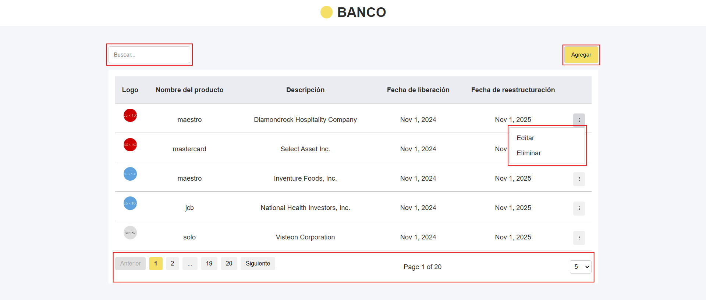
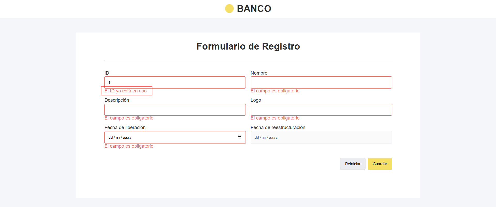
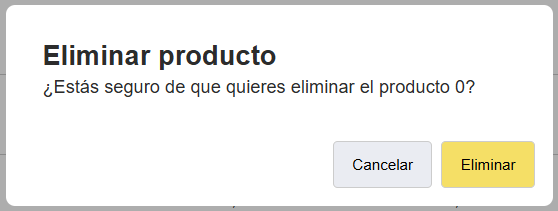

# BankProducts

Este proyecto es un coding challenge hecho con [Angular](https://github.com/angular/angular-cli) version 17

## Development server

    npm run server:client

## Requerimientos

### 1. Listado de productos financieros:

Se requiere una aplicación para visualizar los diferentes productos financieros ofertados por la Institución Banco cargados de una API. Al seleccionar un item, se mostrará toda la información de dicho item en otra vista. Realizar la maquetación en base al diseño.

### 2. Búsqueda de productos financieros:

Se requiere realizar la búsqueda de los productos financieros mediante un campo de
texto.

### 3. Paginación de registros:

Se requiere mostrar una lista paginada de los registros obtenidos.

### 4. Agregar producto:

Se requiere la implementación un botón de "Agregar" para navegar al formulario de
registro, el formulario debe permitir la creación de un producto mediante un botón
"Agregar" y debe permitir la limpieza del formulario mediante un botón de "Reiniciar".
Realizar la maquetación del formulario base al diseño.
Cada campo del formulario contendrá su respectiva validación previa al envío del
formulario:

### 5. Editar producto:

Se requiere un botón que al realizar clic en el permita editar el producto, al hacer clic
se deberá navegar a la pantalla de edición del producto y debe mantener el campo
de ID deshabilitado, el formulario de editar debe mantener las mismas validaciones
de la funcionalidad anterior y mostrar errores por cada campo. Realizar la maquetación
del formulario de edición en base al diseño anterior.

### 6. Eliminar producto:

Se requiere un botón que, al hacer clic, deberá mostrar un modal con un botón de
"Cancelar y un botón "Eliminar", al hacer clic en Eliminar se debe proceder con la
eliminación, en el caso de cancelar seria solo ocultar el modal. se debe realizar la
maquetación del modal en base al diseño.

